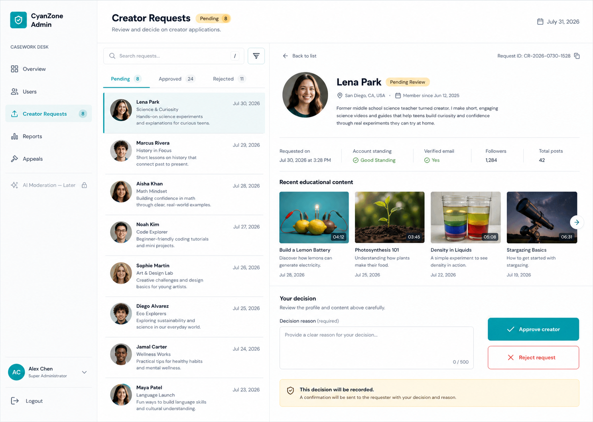

# Administration Portal Before AI Integration Design

**Status:** Approved  
**Date:** July 31, 2026  
**Milestone commit name:** `Admin Portal - before AI-integration`

## Goal

Replace the current static Administration Portal dashboard with a functional,
desktop-first casework portal for:

- registered-user management;
- verified creator management;
- creator-request decisions;
- user-reported content review;
- content-appeal decisions; and
- a complete AI-Flagged Content UI driven temporarily by isolated mock data.

Gemini calls and the real AI-flagged queue remain outside this milestone. The
mock AI dataset must be removable without redesigning the page.

## Approved visual target

The approved direction is the split-pane **Casework Desk** design:



This design is the implementation reference for composition, hierarchy,
spacing, navigation, list/detail behavior, decision controls, and visual tone.
It is not a pixel-perfect source for generated names, counts, dates, or content.

## Product principles

- The portal is an operations workspace, not an analytics dashboard.
- Every queue uses the same list-detail-decision interaction model.
- Potentially harmful decisions require a reason and explicit confirmation.
- Destructive actions are reversible where the data model supports reversal.
- Administrators see clear loading, empty, error, stale, and success states.
- AI preview data must never be presented as live production data.
- The interface remains English-only for the current project scope.

## Scope

### Included

- Existing administrator authentication, role check, session handling, and
  confirmation-based logout.
- Responsive portal shell and client-side routing.
- Overview work-area page.
- Users page with search, filters, detail, suspension/reactivation, and verified
  creator assignment/removal.
- Creator Requests queue with Pending, Approved, and Rejected views.
- Reports queue for reported public posts and comments.
- Appeals queue for rejected posts.
- AI-Flagged Content page with temporary mock data and local-only decisions.
- Privileged Express API routes, administrator authorization, database changes,
  atomic decisions, audit records, and System notifications required by the
  functional pages.
- Automated tests and Chrome/Edge-oriented browser workflow verification.

### Excluded

- Gemini API calls or other AI-provider integration.
- Creation of real AI moderation assessments.
- Background AI moderation workers, timeouts, retries, thresholds, or model
  response parsing.
- Advanced dashboard statistics, trends, charts, creator analytics, or general
  business intelligence.
- Permanent user-account deletion.
- FCM push delivery.
- Parent-supervision administration.

## Information architecture

The persistent left navigation contains:

1. Overview
2. Users
3. Creator Requests
4. Reports
5. Appeals
6. AI-Flagged Content
7. Administrator identity and Log out

Queue items may show operational pending counts. These counts communicate work
awaiting a decision; they are not analytics.

At desktop widths, workflow pages use:

```text
Navigation | Searchable queue/list | Selected record and decision workspace
```

At narrower widths, the selected record replaces the list and provides a clear
Back to list action. Mobile-phone optimization is not required, but the portal
must remain usable without clipped controls or horizontal page overflow.

## Visual system

- Preserve the existing CyanZone palette:
  - cyan `#00A7B7`;
  - deep ink `#172026`;
  - gold `#FFC857`;
  - mist `#F4FAFA`.
- Continue using DM Sans for interface text and Nunito for major headings.
- Use cyan for navigation selection, links, and positive primary actions.
- Use gold for pending attention states.
- Use green for active/approved states.
- Use red only for rejection, removal, suspension, and validation errors.
- Prefer spacing, alignment, typography, and row separators over cards.
- Use borders and shadows sparingly; do not nest cards.
- Use Lucide icons with visible text labels.
- Use readable 14-16 px body text, obvious keyboard focus states, and contrast
  suitable for administrative work.

## Shared portal shell

The current single-file dashboard will be separated into:

- authentication/session boundary;
- portal layout;
- route-aware navigation;
- shared queue/list primitives;
- shared detail sections;
- shared status badges;
- shared decision form;
- shared confirmation dialog;
- shared loading, empty, error, and stale-state presentations;
- typed data clients and feature modules.

Every protected route requires an active Supabase session whose profile has
`is_admin = true` and `account_status = 'active'`.

## Page designs

### Overview

Overview is a work-area landing page rather than an analytics dashboard. It
shows:

- shortcuts to each operational module;
- pending Creator Request, Report, Appeal, and mock AI-Flagged Content counts;
- a short recent-administrator-decisions list; and
- a clear indication when a module has no pending work.

It does not show trend charts, engagement statistics, growth metrics, or
advanced administration analytics.

### Users

The list supports:

- search by name or email;
- Account Status filter;
- Creator Status filter;
- stable pagination; and
- clear Active and Suspended group/status treatment.

The detail workspace shows:

- avatar, name, email, profile ID, biography, join date, and account status;
- verified creator status;
- public profile and published-content summary;
- recent published content;
- Suspend Account or Reactivate Account;
- Assign Creator Status or Remove Creator Status.

Privilege/account changes require a 10-500 character administrator reason and a
confirmation dialog. The current administrator cannot suspend their own account
or remove their own administrator access. Permanent deletion is unavailable.

### Creator Requests

The queue has Pending, Approved, and Rejected views plus search. A request row
shows applicant identity, request date, and a short reason preview.

The detail workspace shows:

- profile and account standing;
- full request reason;
- member-since date;
- verified email state when available;
- recent published educational content;
- previous decision information for completed requests; and
- a 10-500 character decision reason.

Pending requests provide Approve Creator and Reject Request actions. Both
require confirmation. Approval sets `is_content_creator = true`, completes the
request, writes an audit record, and creates the creator-award System
notification atomically.

### Reports

Reports cover public posts and comments. Raw report rows are grouped into one
case by `(target_type, target_id)`.

The configured portal threshold is **three unique reporters**. A case enters the
Pending Review queue only after meeting that threshold.

Portal status labels map to stored report states:

- Pending Review -> `open`;
- Reviewing -> `reviewing`;
- Resolved -> `resolved`, meaning the content was removed;
- Dismissed -> `dismissed`, meaning the content was retained.

The sidebar and Overview pending count represent grouped content cases, not raw
report rows. For example, seven reports about one post produce one pending case
whose detail shows seven unique reporters.

The queue supports status, content-type, and search filters. The selected case
shows:

- reported post/comment and its context;
- author and publication information;
- current visibility;
- unique reporter count;
- grouped report reasons and descriptions;
- chronological report history; and
- previous decision information when completed.

The administrator chooses Retain Content or Remove Content, supplies a 10-500
character reason, and confirms. Retain marks the case reports Dismissed. Remove
marks the content Removed, marks the case reports Resolved, records the action,
and creates a System notification for the content owner.

### Appeals

The queue has Pending, Approved, and Rejected views. The selected appeal shows:

- rejected post and author;
- original rejection date, reason, and available evidence;
- appeal submission date and owner-written reason;
- previous decision information when completed; and
- a 10-500 character administrator decision reason.

Approve Appeal republishes the post and records the appeal as Approved. Reject
Appeal keeps the post rejected and records the appeal as Rejected. Both actions
are confirmed, audited, and notify the content owner.

### AI-Flagged Content preview

The page is fully navigable and uses the same queue/detail/decision layout. It
shows realistic mock cases containing:

- post or comment type;
- author and submission timestamp;
- text and image content when applicable;
- risk score within the uncertain 40%-60% range;
- moderation reason/evidence;
- Pending, Approved, and Rejected preview states;
- a 10-500 character decision reason; and
- Approve Content and Reject Content actions.

A persistent banner states:

> Preview data - Gemini integration is not connected.

Mock data lives in one feature-local adapter/file. Preview decisions update
local React state only and reset on reload. They must not call Supabase, Express,
notifications, or audit storage.

When Gemini integration begins:

1. delete the mock dataset and mock adapter;
2. add the real typed API adapter;
3. retain the approved page, components, routes, and interaction states; and
4. remove the preview banner only after live queue verification succeeds.

## Data and API architecture

The portal follows:

```text
React page -> typed admin client -> Express Admin API -> Supabase
```

Supabase Auth remains the session provider. The portal sends the access token as
a bearer token. Every administrator API route:

1. validates the token;
2. resolves the current user;
3. verifies `is_admin = true`;
4. verifies `account_status = 'active'`; and
5. rejects unauthorized requests without returning protected data.

React does not directly update privilege fields or moderation decisions.

### API groups

- `GET /admin/overview`
- `GET /admin/users`
- `GET /admin/users/:userId`
- `POST /admin/users/:userId/account-status`
- `POST /admin/users/:userId/creator-status`
- `GET /admin/creator-requests`
- `GET /admin/creator-requests/:requestId`
- `POST /admin/creator-requests/:requestId/decision`
- `GET /admin/report-cases`
- `GET /admin/report-cases/:targetType/:targetId`
- `POST /admin/report-cases/:targetType/:targetId/decision`
- `GET /admin/appeals`
- `GET /admin/appeals/:appealId`
- `POST /admin/appeals/:appealId/decision`

List endpoints accept validated search, status, content-type, page, and page-size
parameters where relevant. Responses use typed view models rather than exposing
unbounded table rows.

## Database changes

Add an administrator audit table containing:

- administrator ID;
- action type;
- target type and target ID;
- required reason;
- previous-state snapshot;
- new-state snapshot;
- created timestamp.

Add or update trusted operations so each decision changes business state,
records the audit entry, and creates its System notification in one transaction.

Add administrator read/review support for `post_appeals`. Prevent duplicate
unresolved reports from the same reporter for the same target. Preserve the
existing creator-award notification transition behavior without generating
duplicate notifications.

The report threshold is configured server-side as three unique reporters. The
client cannot override it.

## Decision, error, and concurrency behavior

- Decision forms validate trimmed reasons from 10 to 500 characters.
- A confirmation dialog repeats the target and consequence.
- Decision buttons are disabled while processing to prevent duplicates.
- Decisions are not displayed optimistically.
- Success refreshes queue counts, advances or refreshes the selected case, and
  shows a concise success message.
- Network/API failure preserves search, selection, filters, and typed reason.
- A stale or already-decided target returns HTTP 409. The portal explains that
  the record changed and reloads the latest state.
- A lost/expired session returns HTTP 401 and sends the administrator to login.
- A no-longer-authorized administrator returns HTTP 403 and signs out.
- Missing/deleted content remains reviewable through available audit metadata
  but cannot receive an invalid second decision.
- Empty lists explain why they are empty and how to change filters.
- Unknown server messages are replaced with safe, actionable portal messages.

## Security

- The Supabase service-role key remains server-only.
- API inputs are validated with Zod.
- Administrator authorization is checked on every protected route.
- List pagination and search limits prevent unbounded reads.
- Responses omit private authentication data and secrets.
- Audit records cannot be modified through the client.
- The portal never exposes mock AI data as live data.

## Testing and verification

### API and database

- Authenticated active administrator succeeds.
- Normal, suspended, missing, and expired users are rejected correctly.
- Input, reason-length, pagination, status, and target validation.
- Self-suspension prevention.
- Creator approval/removal and request decisions.
- Three-unique-reporter threshold and grouped-case counts.
- Duplicate unresolved-report prevention.
- Retain/remove report decisions.
- Approve/reject appeal decisions.
- Atomic rollback when audit or notification creation fails.
- HTTP 409 stale-decision behavior.

### React

- Route and navigation selection.
- Split-pane list/detail behavior and narrow-width Back to list behavior.
- Loading, empty, error, retry, stale, and success states.
- Search/filter/pagination behavior.
- Required reason and confirmation flows.
- Disabled duplicate submission.
- Session-expiry and authorization handling.
- AI preview banner, mock cases, local-only decisions, and no network calls from
  the mock adapter.

### Visual and release verification

- TypeScript checks and production builds for Admin and API.
- Automated API and component tests.
- Full Flutter regression suite because notifications/content states are shared.
- Browser workflow verification at desktop and narrow widths.
- Latest Chrome and Edge acceptance for the Administration Portal.
- Direct PowerShell execution outside the Codex sandbox for every command, test,
  analyzer, and build.

## Acceptance criteria

The milestone is complete when:

- all navigation modules render and route correctly;
- Overview contains operational shortcuts but no out-of-scope analytics;
- Users, Creator Requests, Reports, and Appeals use real repository data;
- all real administrator decisions are authorized, validated, confirmed,
  atomic, audited, and notified where required;
- the Reports count represents grouped cases meeting the three-reporter
  threshold;
- AI-Flagged Content provides the complete approved UI using clearly labelled,
  isolated mock data only;
- loading, empty, failure, retry, stale, and success states are verified;
- no permanent user deletion is exposed;
- all relevant automated tests, analyzers, builds, and browser checks pass; and
- the implementation is committed as `Admin Portal - before AI-integration`.
